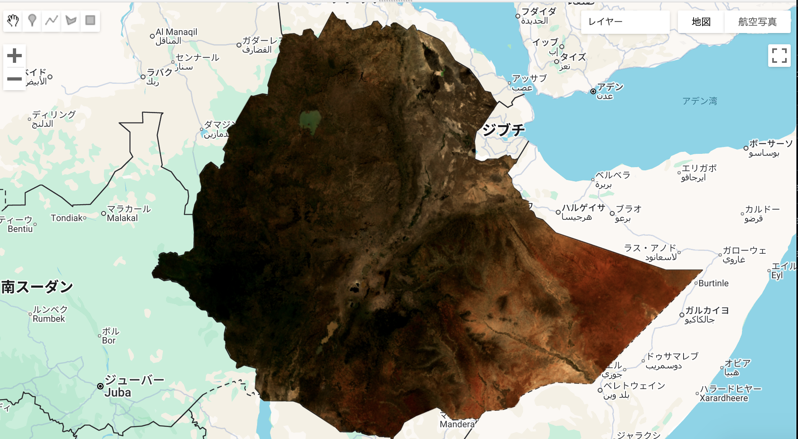

# Cloud-Free Basemap using Landsat 8 (GEE)

## Overview
This project demonstrates how to generate a cloud-free RGB composite image using Landsat 8 Collection 2 Surface Reflectance data in Google Earth Engine (GEE).

## Goal
- Learn cloud masking via QA_PIXEL
- Apply reflectance scaling and RGB composite
- Export result as GeoTIFF for GIS use

## Link to Qiita article
[GEEで雲の少ない自然色画像を作成する](https://qiita.com/akkTYO/items/b6c9614c797003336b2c)

## Code file
- [script.js](./script.js)

## Output
- 
